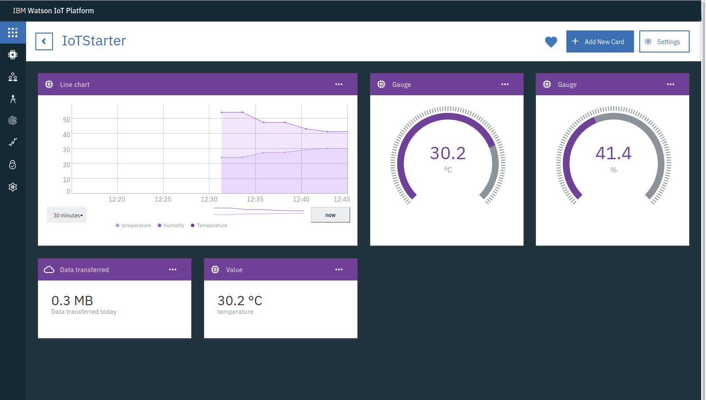

# Set up account and device on IBM Watson IoT platform
The instruction walks you through the process of creating your own IoT device in just a few steps.

An example dashboard that might be created can look like this:


## What is KaaIoT
[IBM Watson IoT Platform](https://internetofthings.ibmcloud.com/) is a clean and simple UI where you can simply and easily add and manage your devices, control access to your IoT service, and monitor your usage. It's free of charge with a limit of up to 500 devices and 200MB of data transfer.

## Installation

### Install requirements

After you've created virtual environment, your current directory should be "iot-starter"

``` 
pip install pyserial cryptography click future pyelftools setuptools
pip install -r KAA/requirements.txt
```

## Set up KaaIoT account

If you are stuck or something will be unclear in next few steps, we recommend looking at official IBM documentation about Getting Started at this [link](https://cloud.ibm.com/docs/IoT/devices/mqtt.html#).

### 1. Create account

First, you need to create an account on IBM Watson IoT Platform website: [ibm.com](https://internetofthings.ibmcloud.com/).


### 2. Create your first application and device endpoint

Create an IoT Platform Service Lite instance directly from the [Platform Service Page in the IBM Cloud Service Catalog](https://cloud.ibm.com/catalog/services/internet-of-things-platform).  

### 3. Create a device

1.In your IBM Watson IoT Platform dashboard, hover over the left side panel, and choose "Devices"
2.Click "Add Device" in the top right corner
3.Create a device type. The device type name must be no more than 36 characters and contain only: Alpha-numeric characters, Hyphens(-), Underscores(_) and Periods(.). For example (IoTStarter)

#### **Device endpoint:**

 1. Hover over the "Device management" option (first one) and select "Devices". In the right top corner select the created application and then "Add device". Make sure you select a good application version and then supply an endpoint token. **IMPORTANT: Make sure to save this endpoint token as you cannot retrieve it later if you forget it.** After that, expand the "Additional metadata" field and click on "Add property". In the "Key" field supply "Label" and in the "Value" some unique identifier for this device (for example IoT-Starter). Click create, save endpoint token.

 2. Lastly, you need to create authentication credentials. For that go to "Device management" and click on "Credentials". On the right side look for a button with "Add basic credentials". On the left side of this button there are three smaller (symbol) buttons. Turn on the first two (plain MQTT and MQTT/TLS). After that all you need to do is create basic credentials, with username and password of your choice. **Remember to save both username and password as you will need it later.** Be careful as username is appended with your tenant id so it will look like: "username@b8e42266-8900-48d1-b99c-165f52j1d4f2"! (Password is not recoverable so make sure you save it for sure!)


After all steps above you should have saved four things:
 - application version
 - device endpoint token
 - username
 - password
