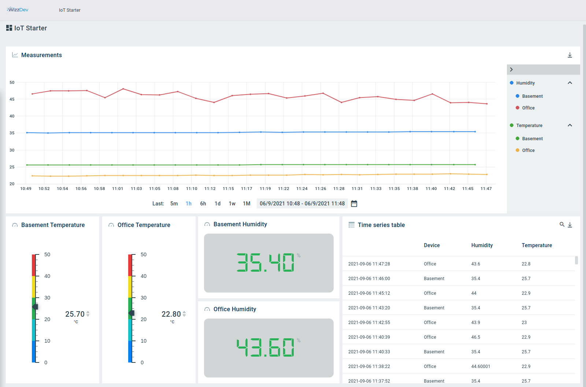

# Set up account and device on KaaIoT cloud platform
The instruction walks you through the process of creating your own IoT device in just a few steps.

An example dashboard that might be created can look like this:


## What is KaaIoT
[KaaIoT](https://www.kaaiot.com/) is a cloud service provider allowing for device management, data collection and visualization. You can create a powerful dashboard in a matter of seconds. It's free of charge with a limit of up to 5 devices.

## Requirements

### Python 3, PIP 
Python can be downloaded from this [website](https://www.python.org/downloads) (in case of using [Anaconda environment](https://www.anaconda.com/products/individual), please skip this part and refer to "**Installation**" section). The Python version required for this project is: either 3.6 or 3.7 (preferably). Please follow installation instructions from their website. 
After installation, you can check if it is installed correctly by typing the following commands in your terminal:

* Linux
```bash
python3 --version
pip3 --version
```
If python3 is not recognized, try "python"

* Windows:
```bash
python --version
pip --version
```

## Installation

### 1. Create virtual environment:
First, you need to create virtual environment (either with python venv module or anaconda-python):

Note, that **"ENV_NAME"** is the name of the environment you’re creating.

Enter main directory of the project (iot-starter):
```bash
cd iot-starter
```

* For anaconda (either in terminal - Linux or anaconda prompt - Windows):
  ```
  conda create --name ENV_NAME python=3.7 pip
  ```

* For venv:
  * Linux:
  ```
  python3 -m venv ENV_NAME
  ```

  * Windows:
  ```
  python -m venv ENV_NAME
  ```

Next, you should activate it. This step is platform dependent:
#### Windows
* For anaconda:
  ```
  conda activate ENV_NAME
  ```

* For venv:
  ```
  ENV_NAME/Scripts/activate.bat
  ```

#### Linux/ Mac OS
* For anaconda:
  ```
  conda activate ENV_NAME
  ```

* For venv:
  ```
  source ENV_NAME/bin/activate
  ```

### 2. Install requirements

After you've created virtual environment, your current directory should be "iot-starter"

``` 
pip install pyserial cryptography click future pyelftools setuptools
pip install -r KAA/requirements.txt
```

## Set up KaaIoT account

If you are stuck or something will be unclear in next few steps, we recommend looking at official Kaa documentation about connecting your first device at this [link](https://docs.kaaiot.io/KAA/docs/v1.3.0/Tutorials/getting-started/connecting-your-first-device/).

### 1. Create account

First, you need to create an account on KaaIoT website: [kaaiot.com](https://www.kaaiot.com/).
Click at the "Use Kaa for free" button at top right corner and follow standard procedure of registration.

### 2. Create your first application and device endpoint

After you log in into your new account (as a root user!), familiarize yourself with the UI and the options at the left side pane. 

#### **Application version and autoextract:**

 1. Hover over the "Device management" option (first one) and select "Applications". In the right top corner click "Add application" and enter the name of your application and (optional) description.
 2. Click on the created application to expand it. On the right side look for "epts" and click on it. There you should see an option **"Autoextract"**. Make sure that the checkbox is checked.
 3. Go back to the application menu and expand the created application again. On the left side of the expanded window you will see “versions”. Click on the plus sign next to add a new version. You should see the "Name" field with a long sequence of random characters (like this one: c2t3ac6gul4q7qik0ol0-). There you should specify a version of your application. Let's go with something simple, add "v1" at the input field. **It is important for you to write this application version down as we will need it later - in this example it looks like: "c2t3ac6gul4q7qik0ol0-v1"**. You can add some optional display name and description for your convenience. After it is created, repeat step 2. but for the created version.

#### **Device endpoint:**

 1. Hover over the "Device management" option (first one) and select "Devices". In the right top corner select the created application and then "Add device". Make sure you select a good application version and then supply an endpoint token. **IMPORTANT: Make sure to save this endpoint token as you cannot retrieve it later if you forget it.** After that, expand the "Additional metadata" field and click on "Add property". In the "Key" field supply "Label" and in the "Value" some unique identifier for this device (for example IoT-Starter). Click create, save endpoint token.

 2. Lastly, you need to create authentication credentials. For that go to "Device management" and click on "Credentials". On the right side look for a button with "Add basic credentials". On the left side of this button there are three smaller (symbol) buttons. Turn on the first two (plain MQTT and MQTT/TLS). After that all you need to do is create basic credentials, with username and password of your choice. **Remember to save both username and password as you will need it later.** Be careful as username is appended with your tenant id so it will look like: "username@b8e42266-8900-48d1-b99c-165f52j1d4f2"! (Password is not recoverable so make sure you save it for sure!)


After all steps above you should have saved four things:
 - application version
 - device endpoint token
 - username
 - password
